# Conversation Flow Map

North Star Support Bot. Six states, one global interrupt rule, and no dead ends.

Every terminal response returns the user to `MENU` and re-offers quick replies.

---

## Mermaid

```mermaid
stateDiagram-v2
    direction TB

    [*] --> MENU

    MENU --> AWAIT_ORDER : order intent, no number in the message
    MENU --> MENU : order intent with 111 or 222 in the same message
    MENU --> ORDER_333_FOLLOWUP : order intent with 333 in the same message
    MENU --> AWAIT_ORDER : bare unknown number, invalid order reply
    MENU --> MENU : returns intent
    MENU --> MENU : shipping intent
    MENU --> MENU : greeting intent
    MENU --> REC_Q1 : recommendation intent
    MENU --> REC_Q2 : an activity label typed straight from the menu
    MENU --> REC_Q1 : a condition label typed straight from the menu
    MENU --> LIVE_AGENT : live agent intent
    MENU --> MENU : courtesy, thanks or goodbye
    MENU --> MENU : yes or no answering the bot's own closing question
    MENU --> MENU : first unrecognized input
    MENU --> LIVE_AGENT : third miss in a row, any kind

    AWAIT_ORDER --> MENU : 111 or 222
    AWAIT_ORDER --> ORDER_333_FOLLOWUP : 333
    AWAIT_ORDER --> AWAIT_ORDER : unknown number, or nothing matched, re-prompt
    AWAIT_ORDER --> LIVE_AGENT : third miss in a row, any kind
    AWAIT_ORDER --> AWAIT_ORDER : "I do not know", acknowledged and counted
    AWAIT_ORDER --> MENU : interrupt, returns or shipping or menu or greeting
    AWAIT_ORDER --> REC_Q1 : interrupt, recommendation
    AWAIT_ORDER --> LIVE_AGENT : interrupt, live agent

    ORDER_333_FOLLOWUP --> MENU : yes, all good
    ORDER_333_FOLLOWUP --> MENU : no, damaged, or any request to return
    ORDER_333_FOLLOWUP --> LIVE_AGENT : live agent
    ORDER_333_FOLLOWUP --> MENU : a different core intent
    ORDER_333_FOLLOWUP --> ORDER_333_FOLLOWUP : unrecognized, re-asks the same question
    ORDER_333_FOLLOWUP --> LIVE_AGENT : third miss in a row, any kind

    REC_Q1 --> REC_Q2 : one of the four activities
    REC_Q1 --> MENU : a different core intent
    REC_Q1 --> MENU : no, cancels the flow
    REC_Q1 --> REC_Q1 : unrecognized, or "I do not know", or out of scope
    REC_Q1 --> LIVE_AGENT : live agent, or third miss in a row

    REC_Q2 --> MENU : one of the four conditions, recommendation delivered
    REC_Q2 --> MENU : a different core intent
    REC_Q2 --> MENU : no, cancels the flow
    REC_Q2 --> REC_Q2 : unrecognized, or "I do not know"
    REC_Q2 --> LIVE_AGENT : live agent, or third miss in a row

    LIVE_AGENT --> LIVE_AGENT : group A, returns or shipping, answered in place
    LIVE_AGENT --> LIVE_AGENT : group A, an order number, known or unknown, answered either way
    LIVE_AGENT --> LIVE_AGENT : group A, identity, contact, bot question, timing, courtesy
    LIVE_AGENT --> LIVE_AGENT : asked for a human again, told he is already connected
    LIVE_AGENT --> LIVE_AGENT : yes or no answering Riley's own closing question
    LIVE_AGENT --> LIVE_AGENT : anything else, logged, acknowledgment rotates
    LIVE_AGENT --> AWAIT_ORDER : group B, order question with no number, handed back
    LIVE_AGENT --> REC_Q1 : group B, gear or catalog question, handed back
    LIVE_AGENT --> MENU : menu, back, home, start over, restart, options

    note right of AWAIT_ORDER
        Slot filling never traps the user.
        A global interrupt always wins. Anything
        that leaves the lookup unresolved counts
        toward one shared stuck counter, and the
        third miss of any kind fetches a person.
    end note

    note right of LIVE_AGENT
        Header animates from deep pine to amber,
        the star glyph becomes a person glyph,
        and the title becomes Riley, Live Agent.
        Riley answers with the bot's own copy so
        the provided data stays identical.
    end note
```



---

## Plain text

```
                                  page load
                                      |
                                      v
   +==================================================================+
   |                              MENU                                |
   |  greeting + quick replies: Track my order / Returns and          |
   |  exchanges / Help me find gear / Talk to a live agent            |
   +==================================================================+
      |            |            |            |            |         |
      |            |            |            |            |         |
 order intent   returns     shipping    recommendation  live      no match
      |         intent      intent        intent        agent        |
      |            |            |            |            |         |
      |            v            v            |            |    +----+----+
      |        policy +     3 to 5 and       |            |    | 1st miss|
      |        30 day /     1 to 2 days      |            |    | "Sorry, |
      |        unused  /       |             |            |    |  I didn't
      |        packaging       |             |            |    |  under- |
      |        + link          |             |            |    |  stand" |
      |            |           |             |            |    +----+----+
      |            +-----+-----+             |            |         |
      |                  |                   |            |    3rd miss
      |                  v                   v            |         |
      |                MENU              +---------+      |         |
      |                                  | REC_Q1  |      |         |
 has a number  ------------------+       | activity|      |         |
 in the same message             |       +----+----+      |         |
      |                          |            |           |         |
      | no                       | yes   one of four      |         |
      v                          |            v           |         |
+-------------+                  |       +---------+      |         |
| AWAIT_ORDER |                  |       | REC_Q2  |      |         |
| "What's     |                  |       |conditions      |         |
|  your order |                  |       +----+----+      |         |
|  number?"   |                  |            |           |         |
+------+------+                  |       one of four      |         |
       |                         |            v           |         |
       |                         |    category level      |         |
       |                         |    recommendation      |         |
       |                         |            |           |         |
       |                         |            v           |         |
       |                         |          MENU          |         |
       |                         |                        |         |
       v                         v                        |         |
  +---------------------------------------+               |         |
  | order number resolved                 |               |         |
  |   111 -> shipped, arriving tomorrow   | -> MENU       |         |
  |   222 -> processing, ships in 24h     | -> MENU       |         |
  |   333 -> delivered  ------------------+               |         |
  |   other -> invalid                    |   |           |         |
  +---------------------------------------+   |           |         |
       |                                      |           |         |
   1st invalid: "I couldn't find an order     |           |         |
   with that number. Give it another check."  |           |         |
       |  stays in AWAIT_ORDER                |           |         |
       |                                      |           |         |
       |  a message with NO digits is not a   |           |         |
       |  failed lookup. It goes to the       |           |         |
       |  global matcher, and if nothing      |           |         |
       |  matches the bot re-prompts without  |           |         |
       |  counting it toward escalation.      |           |         |
       |                                      v           |         |
   2nd invalid in a row            +---------------------+|         |
       |                           | ORDER_333_FOLLOWUP  ||         |
       |                           | "Did everything     ||         |
       |                           |  arrive in good     ||         |
       |                           |  shape?"            ||         |
       |                           +----+-----+------+---+|         |
       |                             yes|   no|   agent|  |         |
       |                                |     |        |  |         |
       |                                v     v        |  |         |
       |                             MENU   return     |  |         |
       |                                    policy     |  |         |
       |                                    + link     |  |         |
       |                                      |        |  |         |
       |                                      v        |  |         |
       |                                    MENU       |  |         |
       |                                               |  |         |
       +-----------------------+-----------------------+--+---------+
                               |
                               v
                    +=======================+
                    |      LIVE_AGENT       |
                    |  divider: Live Agent  |
                    |  connected            |
                    |  Riley steps in with  |
                    |  the full history     |
                    |                       |
                    |                       |
                    |  any message -> noted |
                    |  quick reply:         |
                    |  Back to main menu    |
                    +===========+===========+
                                |
                    menu / back / home / start over
                                |
                                v
                    divider: Back with the support bot
                                |
                                v
                              MENU
```

The diagram above shows the successful paths. Any question the bot asks
(`AWAIT_ORDER`, `REC_Q1`, `REC_Q2`, `ORDER_333_FOLLOWUP`) also has a re-ask
path: an unrecognized answer repeats that question with its own chips and stays
put, and the third miss of any kind escalates. See "Never losing a half finished
flow" and "One stuck counter, three strikes" below.

---

## Junk token gate

The very first check in `handle()`, ahead of intent matching and ahead of the
global interrupt rule below, in every state including `LIVE_AGENT`. If any raw
token contains `< > { } [ ] | ~` or a backtick, matching never runs at all.

This exists because `where is my <abc>?` matches ORDER_TRACKING on its
wording, but `<abc>` is placeholder or injected syntax, never a real attempt
at an order number. Without the gate the bot would enter `AWAIT_ORDER` and ask
for a number it had effectively already been given, garbage. A real wrong
number such as `999` is not junk and still goes through the normal
invalid-order path with its own copy and its own counter.

What happens next branches on state, through the same `unrecognizedInput()`
helper that the empty-after-normalize case uses (a message that strips to
nothing, like `!!!`), because both are dead ends detected before the
state-specific routing that would otherwise make this distinction:

- **MENU, AWAIT_ORDER, REC_Q1, REC_Q2** (any bot-controlled state): the
  standard fallback response, same as any other miss. Counts toward the
  shared stuck counter, so three junk messages in a row still escalates.
- **LIVE_AGENT**: the generic fallback is never called, because it resets
  state to MENU, which would silently drop the user out of the handoff
  without updating the header or the speaker label, and a later third miss
  would re-run the full connect sequence on a user who never left it. Instead
  Riley answers with the same rotating actionable redirect used for any other
  unrecognized input in the handoff. No header change, no divider, no
  reintroduction, state stays `LIVE_AGENT`, and this does not count toward the
  stuck counter, matching how an unrecognized message in the handoff already
  behaved before junk tokens existed as a category. There is nowhere further
  to escalate to: the user is already with a person.

## Placeholder objects in an order-tracking phrase

Checked right after the junk token gate, still before intent matching, and
scoped just as narrowly: only the single trailing word of an order-tracking
trigger phrase ("where is my ___", "track my ___", "wheres my ___" and the
close variants), never the rest of the message and never any other intent's
vocabulary. Two independent checks, either one is enough:

- A small, closed, explicit list of words that are only ever test or
  placeholder filler (`abc`, `test`, `qwerty`, and the rest). Kept even though
  a structural rule also exists below, because most of these are real
  strings, `qwerty` and `sample` read as ordinary words to a structural test,
  and the two shortest, `abc` and `xyz`, are under the structural rule's own
  length floor. Neither check is a superset of the other.
- A structural rule: a letters-only trailing word of 4 or more characters is
  gibberish if it has zero vowels, or a run of 5 or more consecutive
  consonants. This is what catches keyboard-mash nobody named in advance,
  `zxcvbn`, `ghjkl`, `fghjk`. Words under 4 letters are never judged this way.
  A token that is not purely alphabetic, an order number or `order#`, is
  never evaluated by either check, so digits are untouched.

Either check firing routes through the same `unrecognizedInput()` helper as
the junk token gate: standard fallback at MENU or a slot-filling state,
Riley's rotating redirect in `LIVE_AGENT`, same state-branch, same counting
behavior. A real object after the trigger, however plain, crude, or unusual,
satisfies neither check and reaches `AWAIT_ORDER` exactly as before:
`where is my stuff`, `where is my package`, `where is my shit`.

The structural rule has a known blind spot. A mash with exactly one vowel
breaking up the run, `kjwef`, has the same shape as a real word with one
embedded vowel and a short consonant cluster, `purchase`: both max out at a
run of three or four consonants, never five. No threshold on vowel count or
run length separates the two without misclassifying the real word, so a mash
shaped like `kjwef` is not caught. Left as specified rather than patched
around, since patching it would risk the real word it collides with.

## Global interrupt rule

From **any** state other than `LIVE_AGENT`, these are recognized before slot
filling and take priority over the pending question:

| Input | Result |
|---|---|
| `menu`, `main menu`, `back`, `start over`, `restart`, `home`, `options` | reset to `MENU` |
| live agent intent | `LIVE_AGENT` |
| returns intent | returns response, back to `MENU` |
| shipping intent | shipping response, back to `MENU` |
| recommendation intent | `REC_Q1` |
| order intent | `AWAIT_ORDER`, or straight to the status if a number is present |

When an interrupt fires from a slot filling state (`AWAIT_ORDER`, `REC_Q1`,
`REC_Q2`), the bot prefixes the new flow with `Sure, let's switch gears.`

## Inside the handoff

`LIVE_AGENT` keeps the user, but it does not stonewall them. Requirement 3.e.i.3
asks that the user can return to the menu **or keep interacting**, so Riley:

**Riley never starts a flow he cannot finish.** What he can answer in a single
turn he answers himself. What needs more than one turn he hands back to the bot,
which is why the handoff works in both directions.

**Group A, answered in place:**

| Input | Result |
|---|---|
| returns or shipping question | the bot's exact copy, behind a rotating lookup prefix |
| an order number, bare or inside a sentence | that order's status, or told plainly that the number is not found |
| "what is your name" | `I'm Riley, part of the North Star support team.` |
| "are you a bot", "are you human" | says plainly that it is a simulated agent for the demo |
| "when will i hear back", "how soon" | says it has no time to give rather than inventing one |
| website, phone, contact | the returns link only, since that is the only link provided |
| price, stock or carrier | declined by name, since none of that was provided |
| cancel or change an order | says plainly it cannot, rather than asking for a number it cannot act on |
| "what can you help me with" | lists what Riley can actually do |
| hi, hello | greets back, never an acknowledgment |
| anything he cannot answer | an actionable redirect naming what he can do, rotating through three |
| back to bot, chatbot, transfer back | exits to the bot, but only with a movement word alongside it |
| a bot mention with no movement word | stays put, because "you are acting like a bot" is a complaint |
| order 333, then yes or no | Riley asks the delivered follow-up and handles both answers himself |
| asked for a human again | told he is already connected, with the history |
| thanks, bye | courtesy response |
| yes or no answering Riley's own "Anything else?" | closed politely, still in the handoff |
| anything else | logged, acknowledgment rotating through three so it never repeats twice in a row |

The lookup prefix rotates through `Sure, I can pull that up.`, `Let me check
that for you.`, `Of course, here you go.` Direct answers (courtesy, identity,
contact, bot question) take no prefix, because they are not lookups.

**Group B, handed back to the bot:**

| Input | Result |
|---|---|
| gear or catalog question | handback line, `Back with the support bot` divider, then the bot's first recommendation question, state `REC_Q1` |
| order question with no number in it | handback line, divider, then `Happy to help. What's your order number?`, state `AWAIT_ORDER` |
| menu, back, home, start over | exits to `MENU` with the same divider |

All three run inside one turn, so the user sees the handback and the next
question together and can answer immediately.

## Answering the bot's own closing question

Most terminal responses end with "Anything else?". While that is the last thing
said, a bare `yes` or `no` is read as the answer to it rather than as an
unrecognized input. `no`, `no thanks`, `all set` close the conversation
politely; `yes`, `sure`, `please` reopen the menu. A `no` with a real question
attached ("no, where is my order") is treated as the question.

This applies inside `LIVE_AGENT` too, because Riley's factual answers end with
the same closing question. There the close keeps the user in the handoff rather
than returning them to the menu.

The `ORDER_333_FOLLOWUP` state is checked first, so `no` after "Did everything
arrive in good shape?" is still a delivery problem, not a goodbye.

## Never losing a half finished flow

When the bot has asked a specific question and the answer is not recognized, it
re-asks that question with the same chips instead of discarding the flow:

| State | Unrecognized answer gets |
|---|---|
| `REC_Q1` | `Sorry, I didn't understand that. Which of these is closest?` with the four activity chips |
| `REC_Q2` | the same line with the four condition chips |
| `ORDER_333_FOLLOWUP` | `Sorry, I didn't understand that. Did everything arrive in good shape?` with its three chips |
| `AWAIT_ORDER` | `I'll need your order number to look that up.` |

The bot never recites which order numbers exist. A support bot listing valid
order numbers is a privacy failure, so the demo numbers live in the footer as
product chrome for the reviewer, not in anything the bot says. The invalid reply
asks the user to check again and offers a live agent.

Escalation from bad order numbers fires on the third attempt and at most once
per session, so nobody can ping-pong between bot and agent. The `Talk to a live
agent` chip is on every one of those messages, so the user can escalate
themselves rather than being pushed.

## One stuck counter, three strikes

Escalation used to run on three separate counters that never combined, so a user
could miss non-numerically in the order flow forever without tripping any of
them. `nope I dont remember`, `i dont know i said`, `not sure` looped three
times with no way out.

There is now a single `stuckCount`. It increments on any dead end:

| State | What counts as a miss |
|---|---|
| `AWAIT_ORDER` | not a valid order number, not a global interrupt, not the disambiguation answer, including "I don't know" answers |
| `REC_Q1`, `REC_Q2` | not a chip label, not a cancel, not an "I don't know" answer, not a global interrupt |
| `MENU` | matches no intent, or a negation suppressed the only thing that matched |

It resets to zero on any successful resolution, on a global interrupt that
changes flow, and whenever a state is entered fresh. At three, the bot stops
trying and fetches a person:

> I want to make sure you get sorted out. Let me connect you with a live agent.

Misses of different kinds add up, so one bad number plus two "I don't know"
answers escalates just as a plain three-in-a-row does. The `Talk to a live
agent` chip is on every one of these messages so the user can go earlier if
they want. That is requirement 3.e.ii.2 satisfied in sequence: options first,
then escalation.

The cap on firing the connect sequence is once per stuck episode, not once
per session. An `escalationUsed` flag blocks a second `stuckEscalate()` while
it is set, so the bot does not ping-pong between the fallback and the agent
mid-episode, but there are two genuine exits from `LIVE_AGENT` back to the
bot, and both clear that flag along with the state and the counter:
`exitToMenu()`, reached by the `Back to main menu` chip or the equivalent
request in plain text, and `handBackToBot()`, reached when Riley hands a
multi-turn request, an order lookup or a gear question, back to the bot
mid-conversation instead. A user who gets helped, keeps talking to the bot,
and later runs into three fresh misses escalates again, cleanly, with the
full connect sequence, regardless of which of the two exits they took.
Neither flag reset happens on ordinary messages inside the handoff, only on
an actual exit, so more junk while still connected cannot re-trigger it.

In the order flow specifically, "I don't know" is acknowledged rather than
treated as gibberish, but it still counts:

> No worries. If you can't find it, I can pull it up on the agent side instead.

In the two recommendation states a plain `no` is read as "get me out of this"
rather than as a failed answer, and cancels back to the menu. The global matcher
runs before that check, so `wrong size` in the middle of the gear flow is still
a returns question and not a cancel.

## Negation

Negation never crosses a clause boundary. A comma, a semicolon, or a pivot word
(`but`, `however`, `though`, `want to`, `i want`, `i need`, `id like to`)
ends its reach, so `i dont like it, want to return` resolves as a return on the
first turn rather than being read as a refusal to return.

Inside `ORDER_333_FOLLOWUP`, an explicit request to return (`want to return`,
`return it`, `need to return this`) is treated as a no however it is phrased,
and is not length gated, so it resolves in one turn.


The bot must never do the thing it was just asked not to do. A negation marker
(`dont`, `not`, `never`, `no`, `nevermind`) suppresses an intent when it sits
before that intent's first appearance in the message. The negation reaches
forward until the user pivots to what they do want (`just`, `instead`, `but`,
`i want`, `i need`), so:

| Input | Result |
|---|---|
| `dont connect me with live agent` | stays with the bot, no handoff |
| `dont tell me about shipping just find my package` | shipping suppressed, the package request runs |
| `no bot i want human` | the bot is refused, the request for a human runs |
| `order tracking, no return policy` | order flow |
| `return policy, no order tracking` | returns |
| `no` on its own | unchanged, still a plain no |

Self-correction ends a negation immediately. `actually`, `i mean`, `wait`,
`scratch that` and `rather` all reset it, because "no actually X" is "not what
I said before, I meant X", never "not X". `no actually tell return policy`
resolves as returns on the first turn.

Bare `no` and `not` only count as markers in messages longer than three tokens,
and never inside the idioms `no idea`, `no clue`, `not sure`. A marker sitting
at the start of the phrase it matched (`never arrived`, `no sign of it`) is part
of the phrase, not a negation of it.

When a negation suppresses everything and nothing else matched, the bot says so
and asks what the user wants instead, rather than silently doing nothing. That
reply answers nothing, so it counts toward the stuck counter like any other dead
end and cannot loop forever. Refusing the agent is different: "I'll keep you
here with the support bot" is exactly what the user asked for, so it resolves.

## "Order" is a noun and a verb

Getting this wrong meant telling someone who had said outright they had not
ordered yet to hand over an order number, four messages running. The sense is
settled before routing:

| Signal | Sense |
|---|---|
| `buy`, `shop`, or a purchase phrase like `order something`, `havent ordered` | purchase, goes to the gear flow |
| a digit anywhere in the message | lookup, you cannot buy an order number |
| `my order`, `order number`, `order status`, `track`, `where is`, `my purchase` | lookup |
| an intent-to-act marker before the word, with an object after it | purchase |
| nothing decisive | ask, rather than guess |

Purchase wins when both appear, so `i want to order what all products you have`
is a shopping request. When nothing settles it, `i want to order` and `how do i
order` get a question back with `Look up an order` and `Find gear to buy` chips
instead of a demand for a number.

`purchase` is treated as ambiguous like `order`, because "my purchase" is a
noun. `buy` and `shop` are unambiguous and never reach order tracking.

## A known order number always wins

`111`, `222` or `333` as a whole token anywhere in a message is resolved as a
lookup in every state, ahead of yes, no and thanks. `no sorry 111` is a
correction, not a goodbye. `what about 222` inside the handoff gets the status.

## Frustration is a last resort

Swearing and insults are an escalation signal, but only when there is nothing
else in the message. Frustration sits outside the weighted competition entirely
and is checked after normal matching has failed.

`i said give your exchange policy idiot` returns the returns and exchanges
policy. `this is so annoying, where is my order` starts the order flow.
`you idiot` on its own escalates. An annoyed customer who asks a clear question
gets the answer, not an apology and not a comment on their tone.

A known order number sitting anywhere in the message is also treated as a real
request before frustration is considered, so `terrible service, when will 111
arrive` returns the status of order 111.

Inside the handoff there is nowhere further to escalate, so the same input gets
the actionable redirect instead.

## Typos

A corrected form of the message is scored only when the exact and stemmed forms
both found nothing and nothing was negated, so an exact match can never lose to
a guess. Corrections are one edit apart (including a swap of two neighbours,
which is what catches `retrun` and `poilcy`), drawn from a fixed word list, at
most one per message, and blocked for real words that happen to sit one edit
away: `hiring` is never corrected to `hiking`.

`exchance policy`, `retrun poilcy`, `wheres my ordr`, `shippign times` and
`refnud please` all route correctly.

## Gear vocabulary and scope

The four activities and four conditions accept generous synonyms (`trekking`,
`treking`, `fishing`, `glamping`, `snowshoeing`, `heat`, `freezing`,
`monsoon`). Activities outside outdoor apparel and camping gear (`sky diving`,
`scuba`, `golf`) are answered honestly rather than forced into a category, and
are not counted as a miss.

## Questions with no provided answer

Pricing, stock levels, discounts and carriers were never provided, so the bot
declines them by name rather than guessing or quietly redirecting into another
flow. `how much does a tent cost` returns the decline plus the offer of a live
agent, not a gear question. The same applies inside the handoff.

Shipping **cost** is deliberately handled here rather than by the shipping
intent: the brief gives shipping times only.

## Short answers stay short

`yes`, `no` and `thanks` only count as answers when the whole message is five
tokens or fewer. `no` is an answer; `no i already told you that number was
wrong` is a sentence, and it goes through normal matching instead. The same cap
applies to the bare navigation words `back`, `home`, `options` and `help`, so a
long complaint containing the word "back" is not treated as a request to return
to the menu.

## State variables

| Variable | Purpose | Reset when |
|---|---|---|
| `currentState` | the active state | every turn |
| `stuckCount` | consecutive dead ends of any kind, combined | any successful resolution, a global interrupt that changes flow, or a state entered fresh |
| `escalationUsed` | blocks a second connect sequence mid stuck episode | a genuine return from `LIVE_AGENT` to the bot, via `exitToMenu()` or `handBackToBot()` |
| `agentFollowUp` | Riley asked the order 333 delivery follow up and is waiting on yes or no | checked and cleared on the very next message in `LIVE_AGENT`, whatever it contains |
| `recActivity` | answer to recommendation question 1 | a new recommendation flow, a cancel, or once the result is delivered |
| `recCondition` | answer to recommendation question 2 | a new recommendation flow, a cancel, or once the result is delivered |
| `awaitingAnythingElse` | the last bot message ended with a closing question | recomputed after every turn |
| `ackIndex` | which live agent acknowledgment was used last | never, it rotates |
| `prefixIndex` | which live agent lookup prefix was used last | never, it rotates |
| `recTemplateIndex` | which recommendation result template was used last | never, it rotates |

`stuckCount` and `escalationUsed` are described in full in "One stuck
counter, three strikes" earlier in this file. The three separate streak
counters this table used to list, one for fallbacks, one for invalid order
numbers, one for slot misses, each escalating on its second consecutive
miss, were replaced by the single `stuckCount` above, not supplemented by it.
